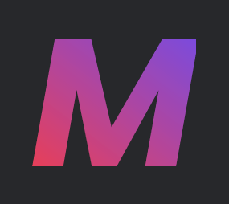
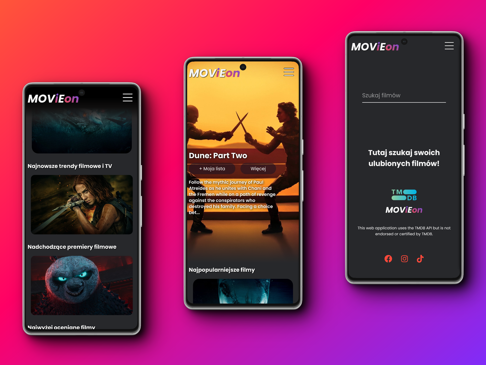

#  MOViEon app
Great news! MOViEon is finally done!🎉🎊

Project built in React💙

The MOViEon project is a movie website similar to streaming services like Netflix and SkyShowTime, it downloads data about movies and series from <a href="https://developer.themoviedb.org/docs/getting-started" target="_blank" rel="noreferrer" rel="noopener"> TheMovieDb API </a>, recommends film premieres and the most popular films and series rated by TMDB users.
MOViEon allows user to store selected movies and series by adding them to the created My List. It allows to search for movies in the provided search engine. Has also a modal showing details of a given movie/series along with a link to the trailer on YouTube.

➡️ Project Link: https://movieon24.netlify.app

MOViEon has a mobile version 📱 !!


## Screenshots

<div align="center"> 
  
  
  
  
  
  
  
  
  
  
  
</div>


## About the Project

Primarily I created MOViEon to learn how to communicate with the API database, practice fetching and learn more about JS promises and try to create a large project based on React.js on my own. 
But MOViEon is more than that. I tried to make it user-friendly and attractive in appearance. It not only shows newest movies or top rated movies or series but it also gives the opportunity to use a saveable My List, according to the user's preferences. LocalStorage is responsible for storing the data saved there. The data is not deleted when the browser is closed, and is available for future sessions with no expiration date. 

To construct MOViEon, I used React.js components, SCSS for styling, Vite, Context API - transfers data globally, LocalStorage - stores data saved in My List, npm Styled Components - carousels on the home page, Material UI - modal with a description for each movie/series and links to trailers on YouTube.


## Table of Contents
- [About the project](#about-the-project)
- [Usage](#usage)
- [Technologies and Tools Used](#technologies-and-tools-used)
- [Setup](#setup)
- [Environment Variables](#environment-variables)
- [License](#license)
- [Acknowledgements](#acknowledgements)
- [Contact](#contact)


## Usage

Usage is really easy. Visit MOViEon home page to learn about the latest film trends and series of the cinema market. 

Click *Więcej* button next to each movie/series to read the description of the selected movie/series, find out about its three main actors, year of production, film genres and take a look at the trailer if it interests you enough. 

Button *+ Moja lista* allows to add every showed movie/series to My list. My list is a storage where user can save his chosen movies or series according to his/her needs. These may be movies that he/her has already watched and wants to keep a list of watched movies or it can be a list of favourites or a list of movies yet to watch. List is editable, user can delete saved data from it any time by using *- Moja lista* button (located on the My List page). 
The choice of use is entirely given to the user. 

The shared movie *search engine* is helpful in the process of creating a personal list. It can be found on search page under the magnifying glass icon in the navigation bar. TMDB's movie database is large and will definitely allow to find another movie worth watching 😉 

To sum up, find a movie, watch trailer or save it on *My List* and move on to the searching of the next one 🎬🎞


## Technologies and Tools Used


 


**LocalStorage**


## Setup

This project uses npm as package manager

```bash
  npm install
```
To run locally
clone the project

```bash
  git clone https://github.com/RosinskaK/MOViEon_project.git
```

Go to the project directory

```bash
  cd MOViEon_project
```

Install dependencies

```bash
  npm install
```

Start the server

```bash
  npm run dev
```


## Environment Variables

To run this project, you will need to add the following environment variables to your .env file

`VITE_API_KEY=`

you need to go to [TheMovieDB API](https://developer.themoviedb.org/reference/intro/getting-started) and download your own API key to get started


## License

[MIT](https://choosealicense.com/licenses/mit/)


## Acknowledgements

- [Vite](https://vitejs.dev/)
- [TMDB](https://www.themoviedb.org/)
- [MUI](https://mui.com/)
- [npm react-multi-carousel](https://www.npmjs.com/package/react-multi-carousel)
- [Canva](https://www.canva.com/)
- [Netlify](https://www.netlify.com/)


## Contact

Created by Kasia Rosińska [@RosinskaK](https://www.linkedin.com/in/katarzyna-rosinska/) - feel free to contact me! 👋

If you ever find any issuses or bugs in my project, please conatact me and give me a notice about it 🙇‍♀️

Live link: https://movieon24.netlify.app

